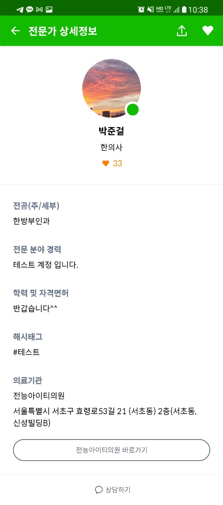
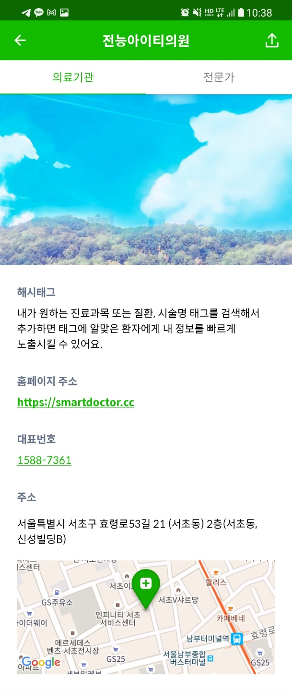
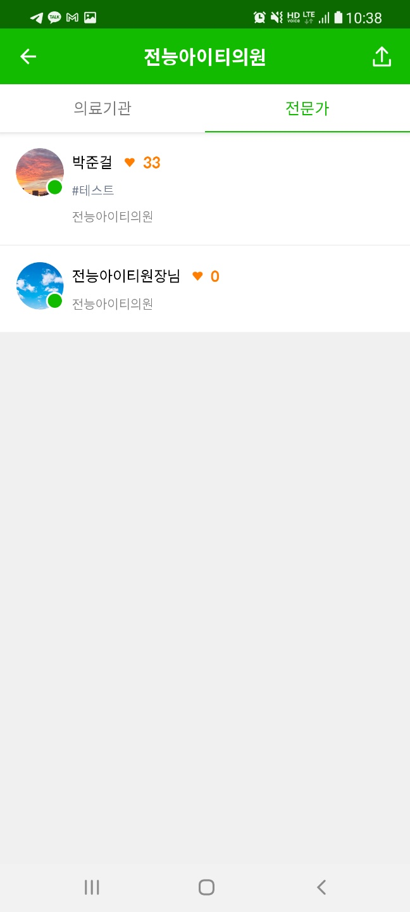

# Doctalk Front

이 프로젝트의 목적은 Android를 활용해서 UI를 만드는 것 입니다.

전달되는 데이터의 형태를 확인하여 하단의 기능을 작동하는 UI를 만들어주시면 됩니다.

UI구조에 정확한 정답은 없으며, 해당 구조로 만든 이유를 설명할 수 있으면 됩니다.

# Guidelines

- 개발언어는 가능하면 Kotlin 으로 부탁드립니다.
- 특정 기능에 대한 라이브러리를 쓰셔도 무방합니다.
- 이미지는 비슷한 아무거나 사용하셔도 무방합니다.
- 작업을 commit 단위로 나눠주세요(필수)

# Screen Shot

## 1. 전문가

- [전문가 데이터](data/expertDetail.json) 을 이용하여 화면을 표시 해주세요
- 하단 바로가기 버튼을 클릭하면 [소속 정보 화면](#1-소속-정보)으로 넘어갑니다

## 2. 소속 상세

* 소속 상세는 소속 정보, 소속 전문가가 있는 탭입니다.
* 아래 이미지에 보이듯이 2개의 탭을 이동하는 방식 입니다.

### 1) 소속 정보

- [소속 데이터](data/companyDetail.json) 을 이용하여 화면을 표시 해주세요
- 소속 전문가를 클릭하면 [소속 전문가 화면](#2-소속-전문가)이 표시됩니다
- 지도는 [Google Map SDK](https://developers.google.com/maps/documentation/android-sdk/overview?hl=ko) 를 사용해 주세요.

### 2) 소속 전문가

- [소속 전문가 데이터](data/companyExpert.json) 을 이용하여 화면을 표시 해주세요
- 소속 정보를 클릭하면 [소속 정보 화면](#1-소속-정보)이 표시됩니다
- 전문가를 클릭하면 [전문가 화면](#1-전문가)으로 넘어갑니다

  
